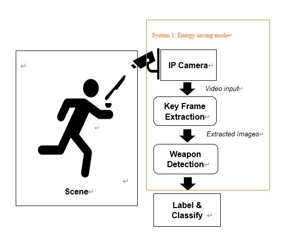
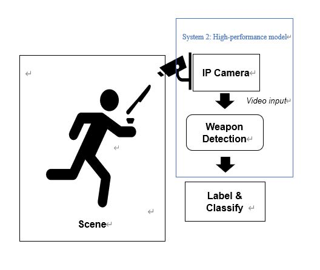
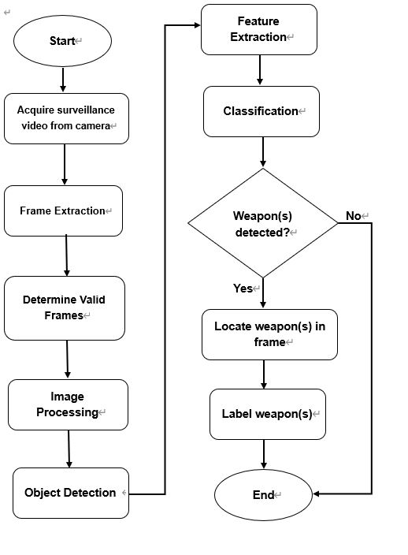

# Overview
AI-based System for Automatic Detection and Recognition of Weapons in Surveillance Video.


This is a collaborative project with a company called `Integrated` and` The Open University of Hong Kong`. The project aims to design an AI-based software function which can automatically detect and recognize firearms, knives, and other weapons in a streaming video captured by surveillance camera.
*****
# Abstract
Security cameras and video surveillance systems have become important infrastructures for ensuring safety and security of the general public. However, the detection of high-risk situations through these systems are still performed manually in many cities. The lack of manpower in the security sector and limited performance of human may result in undetected dangers or delay in detecting threats, posing risks for the public. In response, various parties have developed real-time and automated solutions for identifying risks based on surveillance videos. The aim of this work is to develop a low-cost, efficient, and artificial intelligence-based solution for the real-time detection and recognition of weapons in surveillance videos under different scenarios. The system was developed based on Tensorflow and preliminarily tested with a 294-second video which showed 7 weapons within 5 categories, including `handgun`, `shotgun`, `automatic rifle`, `sniper rifle`, and `submachine gun`. At the `intersection over union (IoU)` value of `0.50` and `0.75`, the system achieved a precision of `0.8524` and `0.7006`, respectively.
*****
# Table of contents
* [Introduction](#Introduction)
* [System](#System)
* [Methodologies](#Methodologies)
* [Environment](#Environment)
* [Usage](#Usage)
* [Result](#Result)

*****
# Introduction
At present, Artificial intelligence is no longer part of a strange new term. Not only the ALPHAGO but also the face scan payment technology, even drones, and driverless vehicles, the application of artificial intelligence gradually involves many aspects of our daily life. No doubt safety is one of the most important aspects of daily life and technology is becoming more mature. Nevertheless, today's mainstream security methods have been unable to meet the numerous security risks posed by technological development. The problem is that it is difficult to find a safe, effective, and low-cost way to ensure security.

So, Artificial intelligence will be used to improve this situation. In Hong Kong, the popularity rate of surveillance cameras is already high. There is a total of 24,591 surveillance cameras. This project plan through combining artificial intelligence with the existing surveillance cameras to automatically detect and recognize firearms, knives, and other weapons in a streaming video captured by a surveillance camera.
****
# System


Above figure shows the functional blocks of the proposed system. After the video is captured by the surveillance camera, it is passed to the keyframe extraction subsystem, which reduces data size by selecting keyframes for the feasible real-time running of the subsequence steps. The extracted frames are then inputted into the weapon detection algorithm. The detected weapons are classified and labeled.



* Mode 1: Energy-saving mode
	Method: 
1. Load the surveillance video
2. Video input into the keyframes extraction system
3. Detect extracted images
4. Labe & classify the weapons
*	Purpose: Within a typical surveillance video, most of the frames are identical due to the fixed location and background. In this case, if it is detected frame by frame, it will cause a waste of computing resources. So according to the keyframe extraction system, detect weapons only when the surveillance video content changes. 
*	Applicable environment: Suitable for the night when the flow of people is low or in low-security risk areas.
* Advantage: short detection time and save computing resources.
*	Disadvantage: There is a certain security risk.


* Mode 2: High-performance mode
	Method:
1.	Load the Real-time surveillance video 
2.	Video as input, detect Real-time directly and frame-by-frame detection
3.	Labe & classify the weapons
*	Purpose: Provide the highest level of security. To eliminate all dangerous situations.
*	Applicable environment: In densely populated areas or periods, or high-security risk areas.
*	Advantage: Provides the highest level of protection.
*	Disadvantage: Consumes a lot of computing power and resources and compare with Energy-saving mode, the detection time is longer.



According to flowchart, when the system starts running, first the system will load the surveillance video captured by the IP camera. But surveillance video usually contains a lot of worthless fragments. As a result, this will cause the system to increase the amount of calculation and slow down the detection speed. So that the system does not go to each frame to detect video. Instead, the system will take an image of the valid frame as an input, to speed up the detection.

When the image is entered into the system, the system will trough grayscale conversion to remove the background features of the image and convert the image into black and white. After the processing finished, the system will detect the objects in the image. Through `Single Shot MultiBox Detector Algorithm (SSD) MobileNet`, the system can extract features from the objects.

After extracting the feature, the system can solve the identification problem and output which category the object belongs to. When the object is detected as belonging to a weapon, the system will locate and label the weapon.

****
# Methodologies
## Key Frame Extraction
When a surveillance video enters the system, because the surveillance video contains many frames and the scenes of many frames are unchanged. If we analyze each frame of video one by one, this will increase the amount of calculation and reduce the detection efficiency. So, for the expected result, the system will extract valid frames and preprocessed videos, for example, capture the screen every 20 frames.

In this project, the keyframe extract algorithm is based on interframe difference. The video sequence captured by the camera is continuous, if there are no moving objects in the scene, the change of continuous frames is very small; if there are moving objects, there will be significant changes between successive frames. So that based on this concept, the interframe difference will be used to extract the keyframe from the surveillance video.

Consider `frame n` and `n-1` of the video sequence as `f_k` and `f_(k-1)`, The grayscale values of the corresponding pixel points of the two frames are denoted as` f_k (x, y)` and `f_(k-1) (x, y)`. Subtract  `f_k (x, y)` and `f_(k-1) (x, y)`, take the absolute value, get the difference image `D_K`


Set the segmentation threshold `T_1`, Then, the difference image is subjected to threshold segmentation to obtain a binarized foreground image.
In this formula, `R_k (x,y)` is the binary foreground image. If the pixel value of a point in the `inter-frame difference` image is less than the threshold value`T_1`, the point with gray value 0 is judged as the background point. If the `D_K (X,Y)` greater than the threshold value `T_1`, the point is judged as the foreground (moving target) point. The operation flow of the `inter-frame difference` is shown below Figure .


    In this project, the local maximum algorithm based on interframe difference is used to extract keyframes. 
    The frames in which the average interframe difference are local maximum are considered to be keyframes.

## Weapons Detection And Recognition
The system was developed based on `TensorFlow`, which is an open-source platform for machine learning; the `Single Shot MultiBox Detector (SSD)`, a popular object detection algorithm; and `MobileNet`, which is a neural network (NN) for producing high-level features. the `SSD-MobileNet` model, which consisted of a `Single Shot MultiBox Detector (SSD)` and `MobileNet lightweight deep neural networks`. In the `SSD_MobileNet`, the `MobileNet` performs as the feature extractor for object prediction or feature extraction at different scales in the convolutional layers. With the extracted features from MobileNet, the `SSD` algorithm was used to obtain the feature information to locate and classify the detected object(s)


Figure shows the operation flow of Object Detection. First, the system gets an image, then crop this image and input this image into the object detection system. After that, the image enters into the `SSD-MobileNet` model, also through TensorFlow, parameters were deployed to the trained model into `SSD-MobileNet`. Finally, the weapons detection result will be got.

In this project, the neural network is trained using supervised classification learning in two basic steps:
1. A dataset from the COCO dataset of each weapon is created.
2. Using the above dataset to train the weapons detector by fine-tuned the existing pre-trained model.

The COCO dataset project is a large visual database for visual object recognition software research. In this project, the data is 1218 machine gun images from the COCO dataset.
The result of fine-tuning is a more efficient model that can detect more Weapons and improve efficiency.
Below is a brief overview of how to fine-tune existing models for custom objects to meet the needs of detecting weapons:

1. Use the images extracted by keyframe extraction function as the train and test images.
2. Use the software ‘LabelImg’, manually label the train images. Create an `XML` file that describes the objects in the pictures. This is called labeling.
3. Convert the `XML` files to `CSV` files.
4. Generate the `TFRecord` file from the `CSV` file.
5. Setting up the configuration file for the model. The initial configuration parameter settings are shown in Table 1.
6. Train the model by using the TFRecord files of the keyframe extraction output images and the configuration file.

      **TABLE 1**
     
Name|     parameter      |
--------- | --------|
 Pretrained model |ssd_moblienet_v1_coco |
Num_classes  | 6 |
Matched_threshold  | 0.5 |
Unmatched_threshold  | 0.5 |
Batch_size  | 5 |
Initial_learning_rate  | 0.004 |
Max_detections_per_class  | 100 |
Max_total_detections  |    100     |

****
# Environment
Table 2 summarizes the software environment used for developing the system’s functions. 

   **TABLE 2**
      
Name|     Version     |
--------- | --------|
 Operating System |Microsoft Windows 10 (64-bit) |
Python  | 3.7.3|
TensorFlow  | 1.14.0|
Graphics Drive  | Radeon Software Adrenalin 19.20|
Conda | 4.7.12 |

## Development environment setup
1. Install Python

* Download`Anaconda3`,make it as the default Python version (3.7.3) and configure the environment variables.

2. Install TensorFlow
Install the CPU version of TensorFlow.
* Call the Command Prompt though `Strat`->`Anaconda3`->`Anaconda Prompt`
```
pip install --upgrade tensorflow
```
## Download TensorFlow object detection API

Download from the  [TensorFlow object detection](https://github.com/tensorflow/models)

***This system donot support TensorFlow versin 2.0 or later***

## Install Protocol Buffers

Download from  [Protocol Buffers](https://github.com/google/protobuf/releases)
* After the UnZip, but the `prtoc.exe` in file`bin` into `C:\\Windows`

## Setup envionment variables for PYTHONPATH
* Add the full directory of folder `Models/Research/` and folder `Models/Research/Slim ` into `PATHONPATH` in  `system variables` of the Windows system

## Testing
* Testing the TensorFlow object detection API, Run the command line under the `Models/Research/`folder
```
python object_detection/builders/model_builder_test.py
```
****
# Usage

## Create training/test data sets
1. Use the images extracted by keyframe extraction function as the train and test images.
2. Use the software ‘[LabelImg](https://github.com/tzutalin/labelImg)’, manually label the train images. Create an `XML` file that describes the objects in the pictures. This is called labeling


In Figure 3.3,it shown the part of the training dataset with the corresponding XML file after labeling.


* For TensorFlow, we need to enter Google’s specific data format, so we need to convert our data into TFRecords Format.
1. Use [gun_xml_to_csv](https://github.com/RunzeXU/AI-detection-weapons/blob/master/gun_xml_to_csv.py) to convert XML file to CSV file.
2. Generate TFRecord file from CSV file through [generate_TRF](https://github.com/RunzeXU/AI-detection-weapons/blob/master/generate_TFR.py)

* create the `PBTXT` file of `label map`,which contain the `weapons name` and `correspond ID`
```
item {
  name: "Sniper rifle"
  id: 1
}
item {
  name: "Automatic Rifle"
  id: 2
}
item {
  name: "Submachine gun"
  id: 3
}
item {
  name: "Shotgun"
  id: 4
}
item {
  name: "Handgun"
  id: 5
}
item {
  name: "Knife"
  id: 6
}
```

* The `weapons name` and `ID` in [generate_TRF](https://github.com/RunzeXU/AI-detection-weapons/blob/master/generate_TFR.py) should be consistent with `lable map`
```
def class_text_to_int(row_label):
    if row_label == 'Sniper rifle':
        return 1
    elif row_label == 'Automatic Rifle':
        return 2
    elif row_label == 'Submachine gun':
        return 3
    elif row_label == 'Shotgun':
        return 4
    elif row_label == 'Handgun':
        return 5
    elif row_label == 'Knife':
        return 6
    else:
        None
```

* Run the [generate_TRF](https://github.com/RunzeXU/AI-detection-weapons/blob/master/generate_TFR.py) with command
```
# From tensorflow/models/
  # Create train data:
  python generate_TFR.py --csv_input=data/gun_train.csv  --output_path=data/gun_train.record
  # Create test data:
  python generate_TFR.py --csv_input=data/gun_test.csv  --output_path=data/gun_test.record
```
* So far, the preparation of all the training and test data  have completed


## Setting configuration file
Find the sample of the configuration file in [model configs of TensorFlow](https://github.com/tensorflow/models/tree/master/research/object_detection/samples/configs)
* In this system,[ssd_mobilenet_v1_coco](https://github.com/tensorflow/models/blob/master/research/object_detection/samples/configs/ssd_mobilenet_v1_coco.config) will adopt
1. Download [ssd_mobilenet_v1_coco.config](https://github.com/tensorflow/models/blob/master/research/object_detection/samples/configs/ssd_mobilenet_v1_coco.config), put the file in to `traning` folder and open it with text editor.
2.  Search for "PATH_TO_BE_CONFIGURED" to find the fields that should be configured.
```
train_input_reader: {
tf_record_input_reader {
input_path: "PATH_TO_BE_CONFIGURED/C:\\Users\\28771\\models\\research\\object_detection\\data\\gun_train.record"
}
label_map_path: "PATH_TO_BE_CONFIGURED/C:\\Users\\28771\\models\\research\\object_detection\\data\\gun.pbtxt"
}
```
```
eval_input_reader: {
tf_record_input_reader {
input_path: "PATH_TO_BE_CONFIGURED/C:\\Users\\28771\\models\\research\\object_detection\\data\\gun_test.record"
}
label_map_path: "PATH_TO_BE_CONFIGURED/C:\\Users\\28771\\models\\research\\object_detection\\data\\gun.pbtxt"
shuffle: false
num_readers: 1
}
```
3. Change `NUM_classes` as practical situation
* In this system, the number of weapons categories are 6
```
num_classes: 6
```
4. If do not have sufficient graphics memory, please change the parameter of `batch_size`
```
train_config: {
batch_size: 5
```
## Training the model
* In the new verion of TensorFlow, the Training file is ：
```
model_main.py
```
* Training model through the following command,set the number of training steps to 200000 and evaluate the number of steps to 6000:
```
# From the tensorflow/models/research/ directory
python object_detection/model_main.py \ 
       --pipeline_config_path=object_detection/training2/ssd_mobilenet_v1_coco.config \ 
       --model_dir=object_detection/training2 \ 
       --num_train_steps=200000 \ 
       --num_eval_steps=6000 \ 
       --alsologtostderr
```
* Through Command Prompt, the training process can be viewed


## Test the model 
After the training, We can test the  model. Find the `export_inference_pictures.py` file under the `Models \ Research \ Object_detection` folder. To run this file, you still need to pass in the `config` and the parameters associated with `checkpoint`.
* Open `Anaconda Prompt` and located under the `Models \ Research \ Object_Detection` folder, run the command:
```
python export_inference_graph.py \ 
       --input_type image_tensor \ 
       --pipeline_config_path training/ssd_mobilenet_v1_coco.config \  
       --trained_checkpoint_prefix training/
        model.ckpt-200000 \  
       --output_directory knife_detection
```
* For `--trained_checkpoint_prefix training/model.ckpt-200000`, the number after the `.ckpt` represent the `checkpoint`, you can find the situation of your own training model under the `training` folder and fill in the corresponding number.( ***If there have more than one number, you can choose the largest one***).


* For`--output_directory knife_detection` is the output directory.After running , you'll find a bunch of files under the `knife_detection` folder. which include `saved_model`、`checkpoint`、`frozen_inference_graph.pb`.And the `fozen model` is trained model.


* After got the `frozen_inference_graph.pb`, we can through [gun_image_testing](https://github.com/RunzeXU/AI-detection-weapons/blob/master/gun_image_test.py) to perform weapons image detection and through [gun_video_testing](https://github.com/RunzeXU/AI-detection-weapons/blob/master/gun_video_testing.py) to perform Real-time weapons detection.
****
# Result
A low-cost, efficient, and artificial intelligence-based solution for the real-time detection and recognition of weapons in surveillance videos has been developed. The system can detect weapons within `6` categories, including `handgun`, `shotgun`, `automatic rifle`, `sniper rifle`, `knife`, and `submachine gun`. At the` intersection over union (IoU)` value of `0.50` and `0.75`, the system achieved a `precision` of `0.8524`and `0.7006`, respectively. At the `Energy-saving mode`, the corresponding time for the system to detect a single image is `1.10` seconds. For `high-performance mode`, the system achieves `real-time` detection and gives weapon detection results synchronized with surveillance video. For a surveillance video, the duration of the video is `148 seconds` the size of the video is 19.8 MB (20,807,246 Bytes), the reaction time of the system detection weapon is also `148 seconds`

* Detection result-submachine gun


* Detection result-handgun


* Detection result-shotgun


* Detection result-sniper rifle


* Detection result-automatic rifle


* Detection result-knife


* Screen capture for Real-time detection


